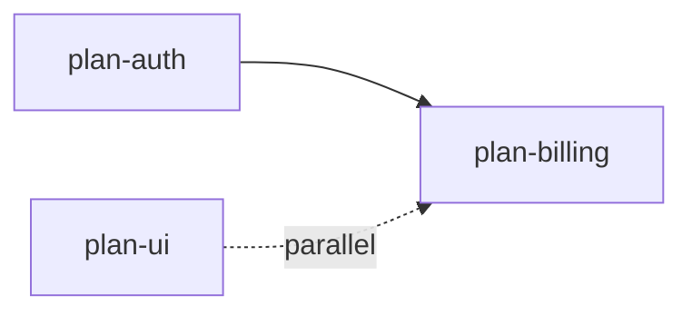

# maestro reference

## Heist plan format

Plans authored by the `heist` skill have these sections:

- `## Crew` — files touched (primary signal for the parser)
- `## Sequence` — ordered tasks
- `## Getaway` — rollback / risks
- `## Payoff` — acceptance criteria

`extract_files.py` uses `## Crew` as the authoritative file list when present. Falls back to a whole-doc path scan when missing.

## Generic format heuristics

For non-heist plans, PRDs, or ADRs, the parser scans for:

- Code-fenced paths: `` `src/foo/bar.ts` ``
- Inline path-shaped tokens: must contain `/` and a file extension
- Skips strings starting with `http`

Risks: false positives from prose-mentioned paths, false negatives when paths aren't quoted. Always show the extracted list to the user and ask them to correct it before running the conflict matrix.

## Phase detection

Looks for a `phase: <X>` line (case-insensitive, anywhere in the doc). Used as a soft signal: same phase + same domain biases toward serial even when no file overlap exists.

## Dep declaration

Recognized prefixes (case-insensitive): `depends on`, `after`, `requires`. Comma-separated list of doc filenames or slugs. Mentioned files matched against the input doc set.

## Conflict verdicts

| Verdict | Meaning |
|---|---|
| `parallel-ok` | No file overlap, no declared dep |
| `serial-required` | File overlap OR declared dep present |
| `not-worth-it` | Doc too small; coord cost > savings |
| `review-needed` | Scattered dirs, unclear isolation |
| `serial-recommended` | Touches migrations or shared schema/types |

## DAG output (mermaid)



ASCII fallback for terminals:

```
plan-auth ──┐
            ├─→ plan-billing
plan-ui  ──┘  (parallel pair)
```

## Dispatch table

| Plan | Worktree path | Branch | Agent type | Mode |
|---|---|---|---|---|
| `docs/plans/auth.md` | `../proj-auth` | `parallel/auth` | `general-purpose` | foreground |
| `docs/plans/ui.md` | `../proj-ui` | `parallel/ui` | `general-purpose` | background |

## Branch naming

All agent-driven branches use the `parallel/` prefix. Slug = plan filename without extension. Rationale: visually marks agent-driven work, lets the cleanup step target safely (`git branch --list 'parallel/*'`), avoids collision with the user's own `feat/`, `fix/`, `chore/` prefixes.

## Worktree commands

```bash
git worktree add ../<repo>-<slug> -b parallel/<slug>
# spawn agent pointed at that worktree
# integration phase: tests pass, then:
git worktree remove ../<repo>-<slug>
git branch -d parallel/<slug>   # only if merged + tests green
```

### Why native `git worktree` vs `Agent({isolation:"worktree"})`

Maestro drives `git worktree` directly via Bash. Does NOT use the `Agent` tool's `isolation: "worktree"` param. Reasons:

- **Named branches**: `parallel/<slug>` is deterministic — cleanup targets `git branch --list 'parallel/*'`. `isolation:"worktree"` generates throwaway branch names.
- **Survives agent exit**: maestro inspects commits, runs integration tests, merges across multiple worktrees after agents finish. `isolation:"worktree"` auto-cleans on agent return when no changes made, and the path is only surfaced post-hoc.
- **User merges manually**: workflow requires the worktree to persist past agent completion so the user can review, merge, and run tests. Skill never auto-merges.
- **Multi-agent coordination**: DAG-ordered merges + per-slug test gating need stable, predictable paths the orchestrator owns.

Use `isolation:"worktree"` only for single-shot isolated edits where the agent owns the full lifecycle. Maestro is the opposite pattern.

## Spawning agents

**Parallel foreground**: a single assistant message containing multiple `Agent` tool calls. Use when the user wants to watch progress and the agents must finish before the next step.

**Background**: `Agent(..., run_in_background=true)` per task. The harness notifies on completion — never poll. Use when the work is long-running and the user wants to keep working in the main session.

Each agent prompt must include:
- Worktree absolute path (the agent's working directory)
- Plan file path relative to the worktree
- Hard scope: "Only edit files listed in the plan's Crew / files-touched section. If you find you need to touch a file outside that list, stop and report instead of editing."
- Commit policy: small commits on the branch, never push, never merge

## Edge cases

- **Not a git repo** → abort, ask user to `git init` or pick a different mode.
- **Dirty working tree** → refuse to create a worktree from a dirty HEAD; ask user to commit or stash first.
- **Branch already exists** → propose `-B` (force) only with explicit user confirmation; default is to pick a different name.
- **Plan parser returns 0 files** → flag the doc as `unparseable`, ask user to annotate the Crew section or skip it.
- **Cycle in declared deps** → print the cycle, abort dispatch.
- **Conversation-only plan** → write the plan text to `.claude/tmp/<slug>.md` first so all scripts can read it; clean up after dispatch.
- **More than one repo touched** → out of scope; this skill orchestrates within one repo at a time.

## Heuristics in `worth_it.py`

| Metric | How it's computed | Threshold | Effect when triggered |
|---|---|---|---|
| `size_score` | `min(len(text) / 2000, 5)` | `< 0.75` (~< 1.5 KB doc) | `not-worth-it` |
| `file_count` | Count of files in `files_touched` | `< 2` | `not-worth-it` (`too-few-files` flag) |
| `distinct_dirs` | Count of unique parent dirs | reported | feeds `isolation` |
| `isolation` | `1 / max(distinct_dirs, 1)` | `< 0.2` (5+ dirs) | `review-needed` |
| `has_migration` | Regex on migration/schema keywords | match | `serial-recommended` (hard rule) |
| `has_shared` | Regex on generated/types keywords | match | `serial-recommended` (hard rule) |

Tune by editing the constants at the top of `main()` in `worth_it.py`: `SIZE_FLOOR`, `ISOLATION_FLOOR`, `MIN_FILES`. Tightened defaults (vs initial draft) — heist plans baseline ~3–5 KB, FE+BE+infra spans 3 dirs without being scattered.

## Integration + cleanup phase

Phase 8 in `SKILL.md`. Per-slug post-merge checklist:

1. User merges `parallel/<slug>` locally — skill never auto-merges.
2. Skill calls `py -3 scripts/detect_tests.py --root <repo>` to discover the runner.
3. Skill runs the runner via `rtk` wrapper when available (token savings).
4. Tests pass → `git worktree remove` + `git branch -d`. Tests fail → keep both, surface failures, abort cleanup for this slug only.
5. Final summary: merged + cleaned vs blocked.

### detect_tests.py probe order

| Signal | Runner picked |
|---|---|
| `package.json` with `vitest` dep | `vitest run` |
| `package.json` with `jest` dep | `jest --ci` |
| `package.json` with `playwright` dep | `playwright test` |
| `package.json` `test` script (no above match) | `npm test` (or pnpm/yarn detected from lockfile) |
| `Cargo.toml` | `cargo test` |
| `pyproject.toml` with `pytest` config / dep | `pytest` |
| `go.mod` | `go test ./...` |
| nothing matched | exits with `{"runner": null}`, skill asks user |

When `rtk` available on PATH, command is prefixed (`rtk vitest run`). User CLAUDE.md mandates rtk usage.

## Cleanup safety

- Never run `git worktree remove --force`. If working dir dirty, refuse and surface to user.
- Never run `git branch -D` (force-delete). Only `-d`. If branch unmerged, refuse and surface.
- Never push, ever, in cleanup. User opts in per slug if they want a remote branch.
